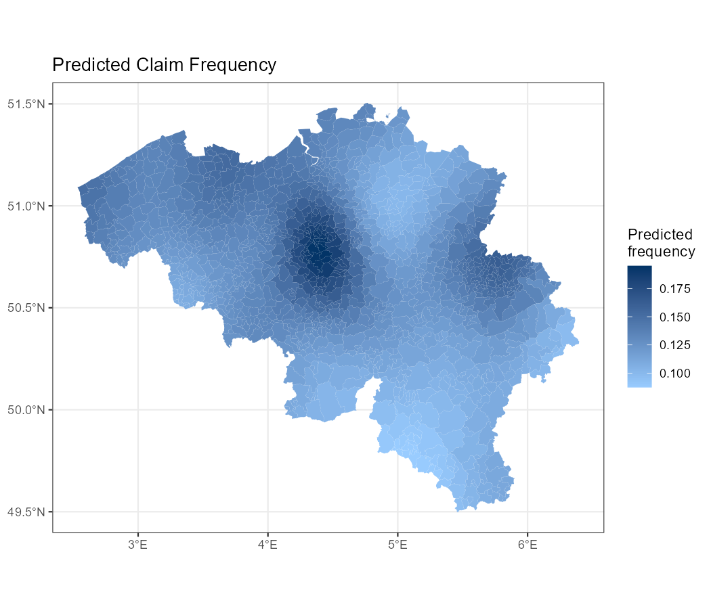
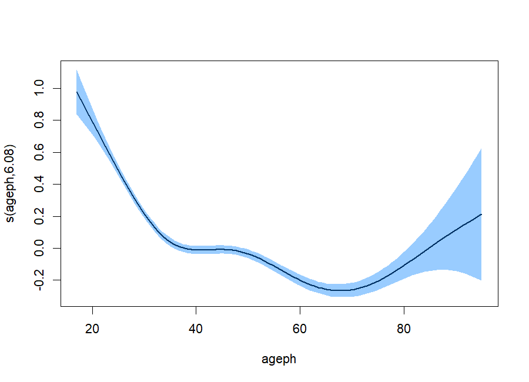
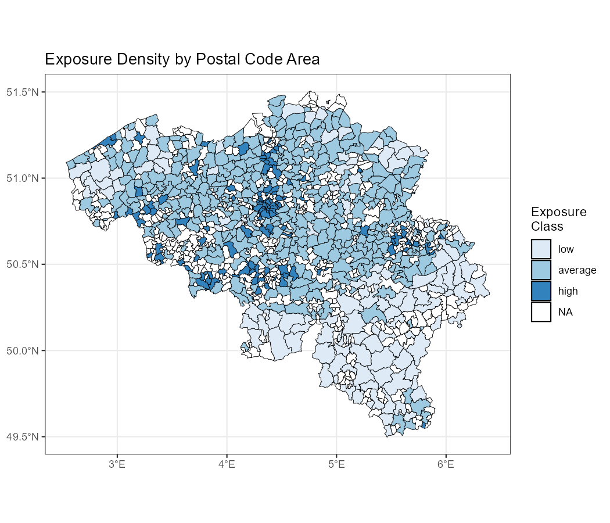

# Motor insurance pricing with GLMs and GAMs

Technical tariff for a Belgian motor third-party liability portfolio of 163,657 policies, written in R. Claim frequency and claim severity are modelled separately, first with generalized linear models and then with generalized additive models that add a smooth effect of policyholder age and a spatial effect based on the policyholder's postal code. Both approaches end in a tariff table with a pure premium for every combination of rating factors, plus a safety loading.

Coursework project for Data Science for Non-Life Insurance, Master of Actuarial and Financial Engineering, KU Leuven (2025). The full write-up is in [`report/Motor_Insurance_Pricing_Report.pdf`](report/Motor_Insurance_Pricing_Report.pdf).

<p align="center">
  
  
</p>

## Data

Each record is one policyholder observed for up to one year, with the exposure, the number of claims, the total claim amount, the policyholder's age and postal code, and nine categorical rating factors (coverage, fuel, sex, car age, payment split, use, fleet, sports car, power). Postal codes are joined to coordinates and to a shapefile of Belgian postal areas.

| Portfolio statistic | Value |
|---|---|
| Policies | 163,657 |
| Total exposure | 145,620 policy years |
| Claims | 20,290 |
| Claim frequency | 13.93% per policy year |
| Average claim severity | EUR 1,622.05 |

The dataset was provided for the course and is not included here. [`data/README.md`](data/README.md) lists the files the scripts expect.

<p align="center">
  
</p>

## Method

**GLM tariff** (`R/3_GLM.R`). The data is split 80/20 into training and test sets. A Poisson frequency model with log exposure as offset is reduced by likelihood-ratio tests and `drop1`, which removes use, fleet and sports car. A negative binomial model with the same seven predictors has a lower AIC and is kept. Severity is modelled as the log of the average claim amount with a Gaussian GLM weighted by claim counts; fuel, sex and power are dropped after F tests. Predicted severities are corrected for the log transform with `exp(mu + sigma^2 / 2)`.

**GAM tariff** (`R/4_GAM_and_checks.R`). The frequency GAM uses the rating factors as parametric terms (reference level is the level with the most exposure), a thin plate spline in age and a bivariate smooth in longitude and latitude. The spatial smooth is fitted separately in `R/2_spatial_GAM.R` to map the predicted frequency over all postal codes. The severity GAM is a log-normal model with coverage, car age, payment split and a smooth in age. The tariff cells have no location, so the tariff frequency model keeps the rating factors and the age smooth only.

| Model | df | AIC |
|---|---|---|
| Poisson GLM, 7 predictors | 14 | 100,768.8 |
| Negative binomial GLM, 7 predictors | 15 | 100,470.6 |
| Poisson GAM, all factors + smooths | 48.6 | 125,560.4 |
| Poisson GAM without use and sports car | 46.5 | 125,558.4 |
| Negative binomial GAM | 46.8 | 125,258.3 |
| Log-normal severity GAM, full | 20.1 | 66,090.66 |
| Log-normal severity GAM, reduced | 16.1 | 66,084.38 |

The GLM and GAM rows are fitted on different data (training set and full portfolio), so AIC is only comparable within each group.

**Safety loading.** The loading is the 95th percentile of the pure premiums across tariff cells minus their mean, added as a constant to every cell.

## Results

Both tariffs have 576 cells (3 coverage levels, 2 fuel types, 2 sexes, 4 car-age bands, 4 payment splits, 3 power bands), priced for one policy year at the median policyholder age.

| GAM tariff | Value |
|---|---|
| Lowest pure premium | EUR 111.17 (MTPL+, petrol, male, car 2 to 5 years, annual payment, under 66 kW) |
| Median pure premium | EUR 273.02 |
| Highest pure premium | EUR 684.21 (MTPL+++, diesel, female, car under 1 year, 3 payments a year, over 110 kW) |
| Safety loading | EUR 182.19 per cell |

The full tables are in [`output/`](output/): `GLM_technical_tariff.xlsx`, `GAM_technical_tariff.xlsx` and `GAM_technical_tariff_loaded.xlsx`.

The age effect in the frequency GAM is highest for the youngest drivers, falls steeply until the late 30s, stays flat until about 50, and reaches its minimum in the late 60s. The spatial smooth puts the highest predicted frequency around Brussels.

## Repository layout

```
run_all.R                  runs the scripts in the right order
R/
  0_setup_and_EDA.R        data import, postal-code join, exploratory plots and statistics
  1_spatial_EDA.R          exposure per unit area by postal code
  2_spatial_GAM.R          spatial smooth of claim frequency, mapped over Belgium
  4_GAM_and_checks.R       frequency and severity GAMs, GAM tariff, safety loading
  3_GLM.R                  frequency and severity GLMs, GLM tariff (reads the data itself)
data/README.md             description of the input files (data not included)
figures/                   plots written by the scripts
output/                    tariff tables written by the scripts
report/                    full project report (PDF)
```

## Running the code

Tested with R 4.4.1. Required packages: tidyverse, sf, mgcv, gridExtra, readxl, openxlsx, knitr, MASS, DescTools, classInt, tmap.

Put the input files in `data/` as described in `data/README.md`, then from the repository root:

```
Rscript run_all.R
```

The full run takes about 20 minutes, most of it in the negative binomial GAMs.
